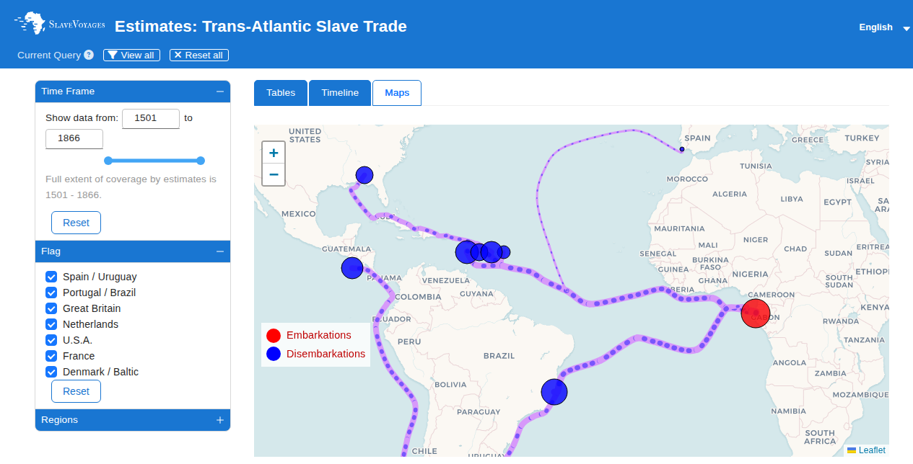

## {.center}

---

## O Caribe, as colônias na América do Norte e o sistema de plantation {.center}

- Como se formou o sistema de plantation nas colônias inglesas e francesas do Caribe?
- Qual o papel dos holandeses nessa transição?
- Como se organizava o trabalho escravo nas plantações de açúcar?
- Quais as diferenças entre Jamaica, São Domingos e o modelo brasileiro?

---

# Rivalidades imperiais e a entrada holandesa {.center}

---

](frans_post_pernambuco.jpg){width=45%}

---

## A União Ibérica e os holandeses {.center}

- 1580–1640: Portugal integrado à Coroa espanhola
- Holandeses: os mais agressivos rivais dos ibéricos no final do século XVI
- 1609: independência de facto das Províncias Unidas
- Companhia das Índias Orientais (1602): tomar o controle do comércio de especiarias na Ásia
- Companhia das Índias Ocidentais (1621): competir diretamente com os portugueses na África e na América

---

## A ofensiva holandesa no Atlântico Sul {.center}

- 1624: captura temporária de Salvador (Bahia)
- 1627: tentativa de tomar Recife; captura da armada espanhola de prata
- 1630: captura de Recife e Pernambuco
- 1638: tomada de El Mina (Costa do Ouro)
- 1641: queda de Luanda e toda a região costeira de Angola

---

## Impactos da ocupação holandesa {.center}

:::incremental
- **Bahia** substitui Pernambuco como principal zona açucareira
- Ressurgimento da **escravidão indígena**: bandeirantes paulistas capturam tribos do interior
- Interior do Brasil aberto à exploração pela primeira vez
- **Brasil holandês**: fonte de ferramentas, técnicas, crédito e escravos para o Caribe
- Fim do **monopólio brasileiro** nos mercados europeus de açúcar
:::

---

# O tráfico de escravos em perspectiva {.center}

---

](mapa_viso_geral_trafico.jpg){width=80%}

---

## Visão geral do comércio de escravos para fora da África (1500–1900) {.center}

- As estimativas do comércio marítimo transatlântico são mais robustas que as das rotas transaariana, do Mar Vermelho e do Golfo Pérsico
- Do fim do Império Romano até 1900: aproximadamente o mesmo número de cativos cruzou o Atlântico que deixou a África por todas as outras rotas combinadas

Fonte: SlaveVoyages.org (consultado em 27/05/2026)

---

## Principais regiões onde os cativos desembarcaram {.center}

- O **Caribe e a América do Sul** receberam **95%** dos escravos que chegavam às Américas
- Menos de **4%** desembarcaram na América do Norte
- Pouco mais de 10.000 na Europa
- Total de embarques documentados: **9.371.001 cativos** (88,5% do estimado)

Fonte: SlaveVoyages.org (consultado em 27/05/2026)

---

## Principais regiões onde os cativos desembarcaram {.center}

](mapa_regioes_desembarque.jpg){width=80%}

---

## Volume e direção do tráfico transatlântico {.center}

- Cativos de **qualquer região da África** podiam desembarcar em **quase todas as regiões** das Américas
- Mesmo cativos do sudeste africano (a região mais distante) podiam chegar à América do Norte, Caribe e América do Sul
- Dados baseados em **estimativas do comércio total**, não apenas em partidas e chegadas documentadas

Fonte: SlaveVoyages.org (consultado em 27/05/2026)

---

## Volume e direção do tráfico transatlântico {.center}

](mapa_volume_direcao_trafico.jpg){width=80%}

---

# Colônias inglesas nas Américas {.center}

---

## Primeiras colônias (1620) {.center}

- Pouco incentivo real: sem investimento financeiro da Coroa
- Mercadores ingleses patrocinam a colonização para garantir o fornecimento de tabaco
- Pequenas Antilhas + Virgínia
- **Servidão por contrato** (brancos britânicos), sem tráfico de africanos escravizados
- Investimentos de capitães de navios e lojistas da metrópole

---

](west_indies.jpg)

---

## 1550–1600: a era dos piratas e corsários {.center}

- Importante papel para a colonização inglesa:
  - Mapear pontos fortes e fracos
  - Identificar as mercadorias
  - Hábitos: fumo, chocolate, dormir em rede, comer churrasco, **ter escravos**

---

## {.center}



---

## Os holandeses e a virada para o açúcar {.center}

- Década de 1640: agricultores holandeses com experiência em Pernambuco chegam a **Barbados, Martinica e Guadalupe**
- Trazem **técnicas modernas de moagem e produção**
- Oferecem **crédito** para compra de escravos africanos e maquinário
- Cargueiros holandeses transportam o açúcar para as refinarias de Amsterdã

---

## {.center}

### **1654**: expulsão definitiva dos holandeses de Pernambuco → migração em massa para o Caribe

---

## A crise do tabaco {.center}

- Virgínia começa a produzir tabaco → crise nos preços europeus
- O açúcar, já plantado em todas as ilhas, tornava-se uma "proposta muito mais viável"
- Os holandeses trouxeram o **crédito necessário** para importar o caro maquinário de moagem
- Forneceram também **escravos africanos a crédito**, de suas feitorias em El Mina e Luanda

---

# Virgínia: da servidão à escravidão racial (1619–1705) {.center}

---

## 1. A transição: servidão → escravidão {.center}

:::incremental
- **1619**: primeiros africanos (navio holandês) inseridos no sistema de **servidão por contrato** — não eram escravos
- Censos de 1623-25: africanos listados como **servants**; *Statutes at Large* (1619-1660) sem nenhuma entrada sob "slaves"
- Caso **Brase** (1625): recebia pagamento em tabaco — "não se paga salário a um escravo"
- **John Phillip** (1624): africano cristão testemunhou em tribunal como homem livre
- **Anthony Johnson** (década de 1650): negro proprietário de 250 acres e 5 servos — mostrava que africanos podiam ser senhores
- Sistema **dual** (1640-1660): servos por prazo e escravos convivendo; cristandade e contrato ainda eram vias de liberdade
- **Caso John Punch** (1640): brancos tiveram pena estendida; Punch condenado à **servidão vitalícia** — primeira sentença judicial de escravidão
:::

---

](old_plantation.jpg){width=55%}

---

## 2. A legislação: fechando as portas da liberdade {.center}

:::incremental
- **1662**: *partus sequitur ventrem* — filho segue condição da mãe (inversão do direito comum)
- **1667**: batismo **não altera** a condição de escravo
- **1669**: matar escravo "por acidente" durante correção **não é crime**
- **1670**: negros e índios libertos **não podem comprar servos cristãos** brancos
- **1680**: lei contra insurreições — escravos não portam armas, não saem sem certificado, 30 chibatadas se levantarem a mão contra cristão
- **1682**: todo não-cristão importado = escravo para a vida, mesmo batizado depois
- **1691**: escravos fugitivos podem ser **mortos**; casamento inter-racial = banimento; alforria = deportação
- **1705**: código escravista completo — escravo sem papel = escravo vitalício; servo branco sem papel = 5 anos
:::

---

## 2. A legislação: o código de 1705 {.center}

:::incremental
- **Seção 3**: servo sem papel escrito = escravo para a vida; impossível reivindicar liberdade sem documento
- **Seção 4**: batismo não altera status — **raça**, não religião, determina a condição
- **Seção 7**: servo branco não pode ser chicoteado nu sem ordem judicial
- **Seção 11**: negros (mesmo cristãos) não podem comprar servos brancos; servo branco de senhor inter-racial = automaticamente livre
- **Seção 37**: escravo fugitivo pode ser **morto ou desmembrado** por qualquer pessoa — propósito: "instilar medo nos outros"
:::

---

## 3. A construção racial: dividir para dominar {.center}

:::incremental
- Brancos e negros trabalhavam lado a lado, fugiam juntos, tinham relações interraciais
- **Rebelião de Bacon** (1676): servos, libertos e escravos unidos queimaram Jamestown — 80 escravos continuaram resistindo após a derrota
- Medo dos planters: aliança interracial = ameaça à colônia
- Estratégia legislativa: **elevar** servos brancos (proteções, privilégios) e **rebaixar** negros (escravidão, desumanização)
- Resultado: classe trabalhadora dividida pela **linha de cor**, protegendo a elite planter
:::

---

## 3. A construção racial: síntese {.center}

> "O uso da raça para separar trabalhadores com condições semelhantes não terminou na Virgínia do século XVII."
> — McLaughlin, 2019, p. 32

:::incremental
- Escravidão não começou como instituição racial — **foi construída** por lei ao longo de 86 anos
- A separação racial serviu para **dividir a classe trabalhadora** e proteger a elite planter
- As sementes de *Dred Scott v. Sandford* (1857) foram plantadas no solo da Virgínia em 1705
:::

---

# Barbados: a transformação drástica {.center}

---

## Barbados antes e depois do açúcar {.center}

| Indicador | 1645 (véspera) | Década de 1680 |
|:--|:--|:--|
| Pop. branca | 37.000 | ~17.000 |
| Pop. escrava | 5.680 | 37.000 |
| Estrutura | Tabaco, pequenas unidades (<10 acres) | Açúcar, latifúndios, 8 mil ton/ano |

---

## Barbados: concentração fundiária {.center}

:::incremental
- Dos brancos colonos imigrantes, apenas 2.000 haviam permanecido
- Sociedade dominada pela **elite dos grandes plantadores**
- 175 agricultores com 60+ escravos controlavam mais da metade dos escravos e das terras
- No final do século: **50 mil escravos** — a região mais densamente povoada das Américas
- Mais de 1.300 escravos trazidos por ano
:::

---

## As ilhas francesas {.center}

- Martinica e Guadalupe: mudança mais lenta que Barbados
- Força de trabalho branca livre mais enraizada
- 1670: ~300 fazendas de açúcar, 12 mil toneladas métricas/ano
- Apenas 15 anos depois dos holandeses terem instalado o primeiro engenho francês eficiente
- 1683: ~20 mil escravos nas maiores ilhas francesas

---

## São Domingos (Saint-Domingue) {.center}

- Colonização francesa na metade ocidental abandonada da ilha de São Domingos (década de 1660)
- Solos virgens extremamente ricos
- 1680: 2 mil escravos africanos, o dobro de habitantes brancos
- Desenvolvimento lento e constante até 1680
- Depois: **expansão acelerada**

---

](habitation_sucriere_1762.jpg){width=45%}

---

# A expansão do século XVIII {.center}

---

## Jamaica {.center}

- Capturada pelos ingleses em 1655 (fracasso do ataque a São Domingos)
- Suplantou Barbados como maior produtor inglês na década de 1740
- Propriedade média: 99 escravos (década de 1740) → 204 escravos (década de 1770)
- 1768: 167 mil escravos, apenas 18 mil brancos → razão 10:1
- 36 mil toneladas de açúcar/ano (4x Barbados)

---

## Novo padrão de exportação inglesa {.center}

- Colônias quebram o padrão de exportação inglesa apenas de tecidos de lã
- Exportação de: pregos, panelas, fivelas, ferramentas, têxteis
- Padrão **multilateral** de comércio: Inglaterra → África → plantations → colônias americanas do Norte

**População escrava (1700)**
- Índias Ocidentais: **81%** de negros
- Virgínia e Maryland: **13%**

---

## São Domingos: a colônia dominante {.center}

- Suplantou Martinica como maior produtor francês
- Maior colônia produtora de açúcar da América
- Década de 1780: **600 mil escravos** — quase metade do milhão de escravos caribenhos
- Exportações maiores que as Antilhas britânica e espanhola **combinadas**
- Mais de 600 navios por ano nos portos da ilha
- Maior produtora mundial de **café** (introduzido em 1723)

---

## Jamaica × São Domingos: diferenças {.center}

:::incremental
- **População livre de cor**: significativa em São Domingos (~26 mil, quase metade da população livre); reduzida na Jamaica
- **Diversificação econômica**: São Domingos produzia café, índigo, algodão, cacau; Jamaica = monocultura açucareira
- **Escala**: São Domingos — 61 mil toneladas/ano; Jamaica — 36 mil
:::

---

## A expulsão dos holandeses {.center}

- 1652: guerra entre Inglaterra e Holanda
- Guerras seguintes destroem a supremacia naval holandesa
- Barreiras tarifárias imperiais contra os holandeses
- Último quarto do século XVII: ingleses e franceses rompem a dependência holandesa
- Impacto direto sobre os **mercados de açúcar do Brasil**:
  - Açúcar brasileiro no mercado de Londres: 80% (década de 1630) → 10% (década de 1690)

---

# O sistema de plantation {.center}

---

## Robin Blackburn {.center}

- Historiador britânico ligado à **New Left**
- Pesquisas de grande fôlego: compreender a formação da escravidão e sua queda numa perspectiva macro
- Aproxima-se de **Eric Williams**: sistema escravista e lucros do tráfico garantiram o avanço econômico britânico e a Revolução Industrial

---

## Diferenças de Blackburn em relação a Williams {.center}

:::incremental
- O capitalismo **não tornou** a escravidão obsoleta
- Luta dos escravizados pela liberdade → aproxima de **C.L.R. James**
- Escravidão = **acumulação primitiva de capital**
- Escravidão **racializada** desenvolvida nas ilhas do Caribe sob domínio inglês
- Formação de uma **"economia atlântica"**: trocas na Costa da África, Caribe, Américas do Sul e do Norte e Europa
:::

---

## Modalidades de economia camponesa sob o escravismo {.center}

1. Camponeses **não-proprietários**
2. Camponeses **proprietários**
3. Atividades camponesas nos **quilombos**
4. **Proto-campesinato** escravo

---

## A transição para o tráfico ampliado (~1650) {.center}

:::incremental
- Queda no uso de **servos de contrato**: epidemias, conspirações, guerra civil na Inglaterra, preço alto do açúcar
- Sentimento racial em construção
- "Vantagens" dos africanos: maior expectativa de vida; custo de manutenção; conhecimento de agricultura tropical
- Leis britânicas legitimando a escravidão negra (já com caráter racializado em meados do século XVII)
:::

---

## Barbados: a virada demográfica {.center}

| Ano | Servos brancos | Escravos africanos |
|:--|:--:|:--:|
| 1638 | 2.000 | 200 |
| 1655 | 8.000 | 20.000 |

---

## Características do sistema de plantation {.center}

:::incremental
- Novo nível de **organização e comercialização intensivas**
- Trabalho escravo em **turmas** supervisionadas
- Trabalho **noturno** — 18 horas de trabalho
- Propriedades entre **50 e 300 escravos**
- **Mortalidade alta** e taxa de natalidade baixa
:::

---

## Características do sistema de plantation {.center}

:::incremental
- Constante aumento na **demanda do tráfico**
- Regime de trabalho mais intenso e com maior **vigilância**
- Demanda de combustíveis: caro e difícil para os escravos se alimentarem
- **Agricultura exaustiva** diminui a produtividade da cana
:::

---

](slaves_cotton_west_indies_1751.jpg)

---

## Organização do trabalho nas plantações {.center}

- **50 a 60%** dos escravos: trabalho de campo
- ~10%: moagem e refino do açúcar
- <2%: domésticos
- Restante: transporte, ofícios qualificados, muito jovens ou idosos
- **Mulheres dominam** as turmas de campo (~60% em todas as turmas)

---

](sugar_cane_manufacturing.jpg)

---

## Turmas de trabalho nas ilhas francesas {.center}

- **Grand atelier**: homens e mulheres jovens, boa compleição física
- **Second atelier**: físico menos capaz (recém-chegados, mães recentes, convalescentes)
- **Petit atelier**: crianças de 8 a 12/13 anos, tarefas simples
- 3/4 das mulheres na plantação → turmas do campo
- Homens: 10% nas refinarias, restante em ofícios qualificados

---

](digging_cane_holes_antigua.jpg){width=40%}

---

## A eficácia brutal do sistema {.center}

> "O sistema de plantation era o meio mais eficiente de produção de colheitas comerciais desenvolvido pelos europeus antes da Revolução Industrial." (KLEIN & VISION III)

---

## A eficácia brutal do sistema {.center}

- ~80% da população escrava economicamente ativa (vs. 55% em sociedades agrícolas atuais)
- Ausência de discriminação sexual nas tarefas de campo
- Crianças trabalhando a partir dos 8 anos
- Preços de escravos homens e mulheres saudáveis: iguais até a idade madura

---

](cutting_sugar_cane_antigua.jpg){width=40%}

---

## Brasil: estrutura diferente {.center}

- Até final do século XVIII: **4 plantações agrupadas em torno de 1 moinho** (engenho)
- 3 eram **lavradores de cana** (pequenos: ~10 escravos cada)
- 1 **senhor de engenho** (~70 escravos nos campos)
- Total: ~100 escravos por unidade de moagem (metade da Jamaica)
- Estação de moagem na Bahia: 3 meses **mais longa** que a estação de corte no Caribe

---

## Ciro F. S. Cardoso: plantation como sistema {.center}

1. Dois setores agrícolas: **escravista** (para o mundo) + **camponês** (subordinado ao primeiro)
2. Baixo nível das forças produtivas; utilização **extensiva** dos recursos naturais e da força de trabalho
3. **Inseparável**: sistema e capital mercantil
4. minimização de gastos; autossuficiência; concentração de recursos para o mercado global
5. **tráfico de escravos**; vigilância, repressão

---

# Códigos legais para o controle de escravos {.center}

---

## Code Noir, legislação inglesa e controle dos livres de cor {.center}

:::incremental
- **Code Noir** (1685): controle público, fora das *habitations* (plantations)
  - Autonomia total dos senhores no governo doméstico
  - Não trata do trabalho
  - Crime contra a ordem pública: punição rígida
- **Legislação inglesa**: controlar a **insurreição escrava**
:::

---

## A exclusão dos livres de cor {.center}

- Nas colônias **inglesas**: livres de cor = minoria distinta, mesmo entre a pequena população livre
- Nas colônias **francesas**: mais significativos em São Domingos (metade da população livre), mas reduzidos nas outras ilhas
- No **Brasil** e na **América espanhola**: livres de cor = parte importante do mundo da plantation
- Essa diferença demográfica moldaria profundamente as **dinâmicas sociais e políticas** — e teria consequências decisivas na **Revolução Haitiana**

---

# Atividade prática: SlaveVoyages {.center}

---

## Explorando o tráfico atlântico de escravizados {.center}

🔗 [**slavevoyages.org/assessment/estimates**](https://www.slavevoyages.org/assessment/estimates) 

---

## O que é o SlaveVoyages? {.center}

- Base de dados digital sobre o tráfico transatlântico de africanos escravizados
- Compila estimativas baseadas em registros documentais de viagens (1501–1866)
- Permite **pesquisar, filtrar, visualizar e baixar dados** sobre o tráfico
- Três modos de visualização: **Tabelas**, **Linha do tempo** e **Mapas interativos**
- Ferramenta fundamental para a historiografia da escravidão atlântica

---

## Parâmetros de busca disponíveis {.center}

:::incremental
- **Time Frame**: período (1501–1866), com slider e campos numéricos
- **Flag** (Portadora nacional): Spain/Uruguay, Portugal/Brazil, Great Britain, Netherlands, U.S.A., France, Denmark/Baltic
- **Regions** → **Embarkation Regions** (regiões de embarque na África)
- **Regions** → **Disembarkation Regions** (regiões de desembarque nas Américas): subdivididas por império
:::

---

## Busca 1: Volume do tráfico para o Caribe britânico {.center}

**Objetivo**: visualizar a escala da escravidão nas ilhas produtoras de açúcar

---

## Busca 1: Volume do tráfico para o Caribe britânico {.center}

:::incremental
1. **Time Frame**: 1601–1800
1. **Flag**: deixar todos selecionados
1. **Regions** → desmarcar todos os Disembarkation Regions, exceto: **Jamaica**, **Barbados**, **Antigua**, **St. Kitts**, **Grenada**, **Dominica**, **Other British Caribbean**
1. Mudar para a tab **Timeline** → observar o pico de desembarques
1. Mudar para a tab **Maps** → visualizar os fluxos
:::

---

## {.center}

**Pergunta**: Em que período o tráfico para o Caribe britânico atingiu seu pico? Como isso se relaciona com a transição do tabaco para o açúcar?

---

## Busca 2: Comparação Caribe britânico vs. Saint-Domingue {.center}

**Objetivo**: comparar o volume de cativos nas duas maiores potências açúcarneiras

---

## Busca 2: Comparação Caribe britânico vs. Saint-Domingue {.center}

:::incremental
1. **Time Frame**: 1701–1800
1. **Flag**: Great Britain + France (desmarcar os demais)
1. **Disembarkation Regions**: marcar **Jamaica**, **Barbados** (britânicas) e **Saint-Domingue**, **Martinique**, **Guadeloupe** (francesas)
1. Tab **Tables** → Rows: "50-year periods"; Columns: "Disembarkation regions"; Cells: "Only embarked"
1. Observar os números absolutos por ilha
:::

---

## {.center}
**Pergunta**: Qual ilha recebeu mais cativos no século XVIII? Como isso se reflete na produção açucareira descrita por Klein & Vision III?

---

## Busca 3: Origens africanas — de onde vinham os escravizados? {.center}

**Objetivo**: mapear as regiões de embarque na África que abasteceram o Caribe

---

## Busca 3: Origens africanas — de onde vinham os escravizados? {.center}

:::incremental
1. **Time Frame**: 1651–1800
1. **Flag**: manter todos
1. **Disembarkation Regions**: marcar apenas as ilhas do Caribe (Jamaica, Barbados, Saint-Domingue, Martinique, Guadeloupe, Dutch Caribbean)
1. Tab **Tables** → Rows: "50-year periods"; Columns: "Embarkation regions"
1. Observar quais regiões africanas predominam em cada período
:::

---

## {.center}

**Pergunta**: Qual região africana forneceu mais cativos para o Caribe? Houve mudança nas origens ao longo do século XVIII?

---

## Busca 4: Holandeses — império de contrabando {.center}

**Objetivo**: evidenciar o papel holandês no tráfico e seu deslocamento para as Guianas

---

## Busca 4: Holandeses — império de contrabando {.center}
:::incremental
1. **Time Frame**: 1601–1800
1. **Flag**: marcar apenas **Netherlands**
1. **Disembarkation Regions**: manter todos
1. Tab **Tables** → Rows: "50-year periods"; Columns: "Disembarkation regions"
1. Tab **Timeline** → observar a curva ao longo do tempo
:::

---

## {.center}

**Pergunta**: Para onde os holandeses direcionaram seus cativos após perderem o controle das ilhas? Como isso dialoga com a tese de Klein & Vision III sobre o papel holandês?

---

## Busca 5: O minúsculo tráfico para a América do Norte {.center}

**Objetivo**: contrastar a escala do Caribe com a América do Norte britânica

---

## Busca 5: O minúsculo tráfico para a América do Norte {.center}

:::incremental
1. **Time Frame**: 1501–1866
1. **Disembarkation Regions**: desmarcar tudo, marcar apenas **Chesapeake**, **Carolinas/Georgia**, **Northern U.S.**, **Gulf states**, **U.S.A. unspecified**
1. Tab **Timeline** → comparar visualmente com a Busca 1
:::

---

## {.center}

**Pergunta**: Menos de 4% dos cativos desembarcaram na América do Norte. Como essa proporção ajuda a entender por que as colônias norte-americanas desenvolveram dinâmicas sociais tão diferentes das caribenhas?

---

## Como exportar e discutir os dados {.center}

:::incremental
- **Download Table**: botão na tab Tables → exporta CSV para análise
- **Download Timeline Data**: botão na tab Timeline → dados anuais
- **Screenshot dos mapas**: use para documentar suas observações em sala
:::

---

## Bibliografia da aula {.center}

- KLEIN, Herbert S.; VISION III, Ben. O açúcar e a escravidão no Caribe nos séculos XVII e XVIII. In: *A escravidão africana na América Latina e Caribe*. Brasília: Editora Universidade de Brasília, 2015.
- McLAUGHLIN, Randolph M. The Birth of a Nation: A Study of Slavery in Seventeenth-Century Virginia. *UC Law Journal of Race and Economic Justice*, v. 16, n. 1, 2019, pp. 1–34.
- BLACKBURN, Robin. *The Making of New World Slavery: From the Baroque to the Modern, 1492–1800*. London: Verso, 1997.
- CARDOSO, Ciro F. S. (org.) *Escravidão e abolição no Brasil: novas perspectivas*. Rio de Janeiro: Jorge Zahar Editor, 1988.
