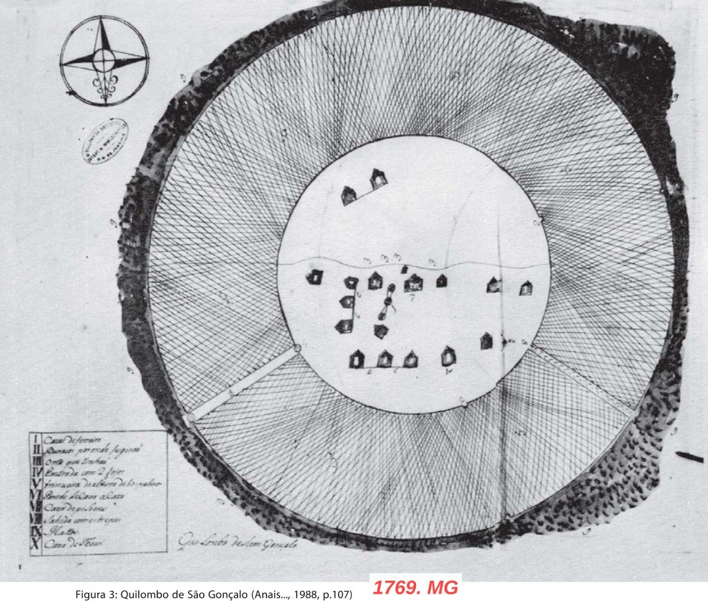
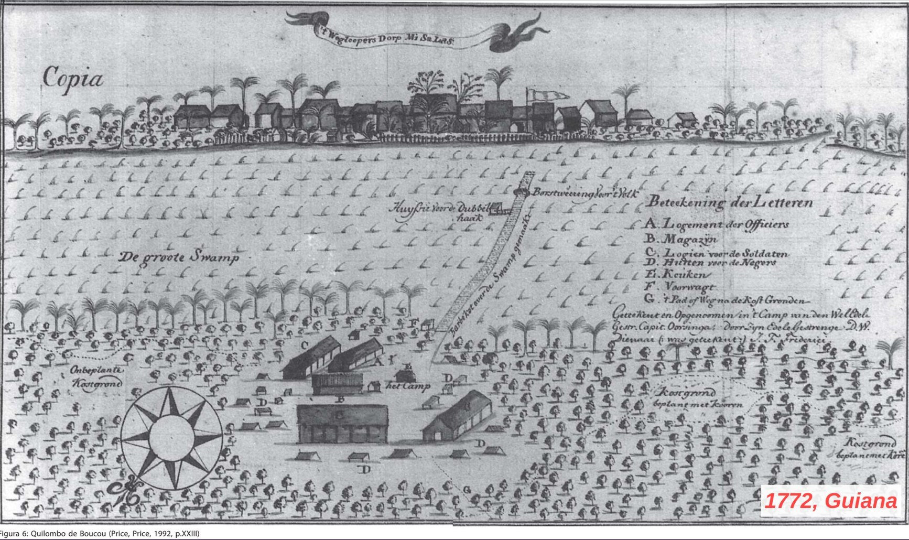
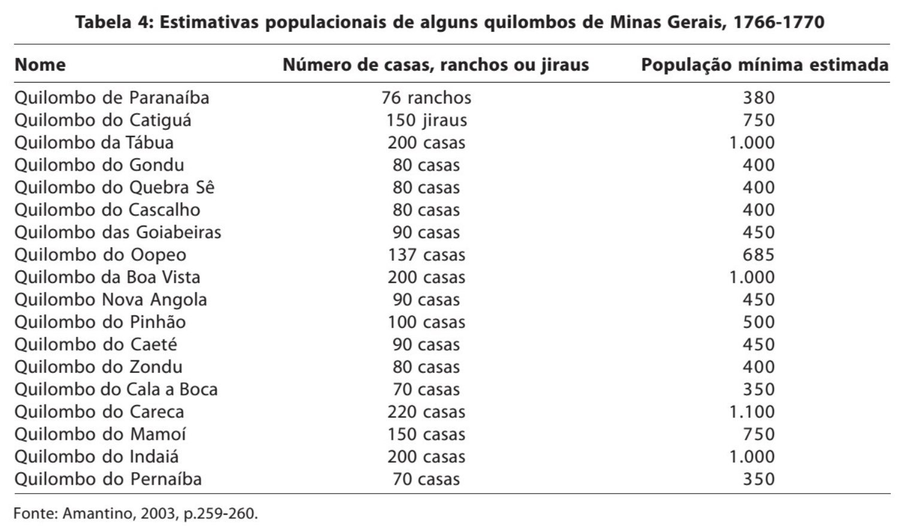
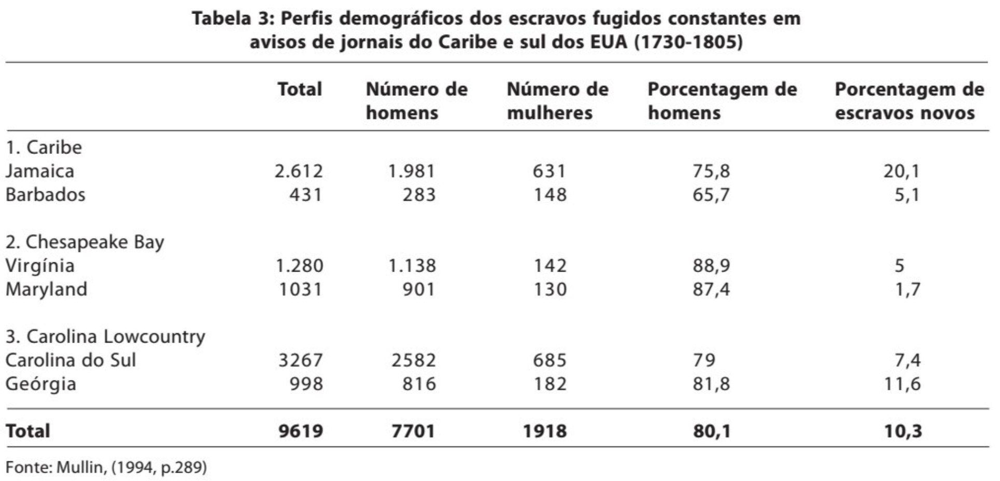

## {.center}

---

## Lutas contra o cativeiro, lutas pela liberdade — parte 1 {.center}

- Como um escravizado resiste?
- Quais as variações no tempo e no espaço?
- Como estudar e pesquisar? Que fontes?

---

# Historiografia {.center}

---

## O mito da escravidão branda {.center}

- Gilberto Freyre (1933): tese da "amenidade das relações senhor/escravo"
- Frank Tannenbaum (1947): escravismo ibérico "brando" vs. anglo-saxão "desumano"
- Stanley Elkins (1959): teoria do "Sambo" — escravo resignado, dócil, infantilizado
- Louis Couty (1881): "O Brasil é um país sem povo" — base do "paradigma da ausência"
- Essas interpretações compartilham a negação da agência escrava

---

## O "paradigma da ausência" {.center}

- Joaquim Nabuco: a liberdade teria de ser "doada ou concedida" aos negros
- Escravos como seres "incapazes de ação autonômica" (F. H. Cardoso)
- A escravidão teria aniquilado pessoas e cultura, restando "fragmentação e vazio"
- Narrativa teleológica da Nação que apaga sujeitos e conflitos
- Denúncia do mito da democracia racial, mas com o custo de desqualificar os escravos como sujeitos históricos

---

## A revisão dos anos 1960-70 {.center}

- Cardoso (1962), Ianni (1962), Costa (1966): contestam a tese da escravidão branda
- Enfatizam a violência e a exploração inerentes ao sistema escravista
- Jacob Gorender (1978): modo de produção escravista implicava "extermínio da vitalidade do escravo"
- Limite: ao enfatizar a violência, acabaram por reforçar a imagem do escravo como vítima passiva
- A própria denúncia da democracia racial reproduziu a "teoria do escravo-coisa"

---

## O "paradigma da agência" {.center}

- Virada dos anos 1980: romper com a associação entre subordinação e passividade
- Influência de E. P. Thompson: "costumes em comum" (*customs in common*) também formatavam a experiência dos escravos
- Escravos criam "visões escravas da escravidão" que impõem limites ao poder senhorial
- A violência como ponto de partida da análise, não como modo de arrestar a investigação
- Rebecca Scott: "numerosas maneiras de examinar as iniciativas dos escravos sem desconsiderar a opressão"

---

## Cultura legal e "campo de força comum" {.center}

- Escravos demandam liberdade na justiça, obtendo-a à revelia da vontade senhorial
- Leis de emancipação gradual: ambiguidades que abriam brechas para conflito social
- Estado escravista como espaço contraditório, não como sujeito unívoco
- "Costumes em comum" formatam a arena da luta de classes na escravidão
- Questões centrais: compra e venda, castigo físico, alforria, direito à família e comunidade

---

## Rebeldia escrava: tipologia {.center}

- **Individual**: suicídio, aborto, assassinato de senhores, auto-mutilação, fuga
- **Coletiva**: quilombos, insurreições, revoltas urbanas
- Fuga como protesto mais comum; podia levar à formação de quilombos
- Quilombos: "nascem espontaneamente", buscam paz, usam violência para sobreviver
- Revolta dos Malês (1835, Bahia): "o levante de escravos urbanos mais sério ocorrido nas Américas" (Reis, 1986)

---

## O "muro de Berlim historiográfico" {.center}

- Separação artificial entre historiadores da escravidão e do movimento operário
- "Paradigma da ausência" também na história operária: trabalhadores como vítimas de modernização incompleta
- Novo sindicalismo pós-1978 questionou a imagem de passividade e atrofia histórica
- Paralelo: escravos que usavam a lei de 1871 ↔ trabalhadores que mobilizaram a Justiça do Trabalho
- Proposta: agendas comuns centradas em "classe, luta de classes, gênero, raça, ideologia, hegemonia"

---

## Questões abertas e agenda de pesquisa {.center}

- Revoltas "em toda a extensão do período colonial": investigações ainda insuficientes
- Generalizações sobre sudaneses (insurreições) vs. bantos (quilombos) carecem de mais pesquisas regionais
- Animosidade entre africanos e afro-brasileiros: fenômeno baiano ou geral?
- Carência de estudos empíricos sobre a Justiça do Trabalho: "a leitura de centenas de dissídios" ainda está por fazer
- Superar o "muro de Berlim historiográfico" exige reformular os modos do pensamento historiográfico

---

# Quilombos, Palenques, Cimarrones, Maroons {.center}

---

## Quilombos, Palenques, Cimarrones, Maroons {.center}

- Variedade e diversidade
- Redes de sociabilidade
- Economia, proto-campesinato
- Ação política?

---

## Características das comunidades cimarronas {.center}

- Regiões inacessíveis
- Defesa: caminhos, estacas, armadilhas
- Guerra de guerrilha
- Práticas religiosas
- Adaptação econômica e tendências inovadoras
- Contato e aprendizado com as sociedades nativas

---

## Características das comunidades cimarronas {.center}

- Dependência da sociedade de plantation: limite das sociedades cimarronas
- Contato e relações com a sociedade de plantation: comércio, trocas, contrabando — mas também relações políticas
- Organização interna + estado de guerra: lealdade; período de prova para novos membros, autoridade interna forte, questão de gênero

---

{width=70%}

---

{width=70%}

---

## Redes de interação e sociabilidade {.center}

- Herança africana: destreza militar, estratégias de ataque e defesa, emergência de lideranças fortes, hierarquia rígida e em alguns casos de escravidão (p. 285)

---

## Redes de interação: alianças {.center}

> "Os palenques mantinham graus razoáveis de interação com escravos, indígenas, forros e homens livres que viviam em seu entorno, e senhores e autoridades coloniais sabiam que as redes que os uniam eram fundamentais para a reprodução e o crescimento dos grupos de fugitivos." (p. 273)

---

## Redes de interação: alianças {.center}

- Pena de morte para fugitivos de mais de 6 meses com contato com quilombolas
- "Redes estáveis de sociabilidade e auxílio permitiam a obtenção de alimentos, armas, munição, dinheiro e informações que garantiam a sobrevivência presente e futura" (p. 273)
- Relação de aliança com muitas comunidades indígenas, especialmente em regiões de fronteira

---

## Organização interna {.center}

> "Além dos variados tipos de relações com o entorno, a reiteração temporal das grandes comunidades palenqueras repousava na possibilidade de combinar eficientemente uma população em crescimento, mantida por sistemas agrários razoavelmente produtivos, um panorama de significativo incremento de relações de parentesco a unir seus membros, hierarquias internas bem estruturadas." (p. 279)

---

{width=90%}

---

{width=90%}

---

# Formas de resistência {.center}

---

## A fuga como resistência {.center}

- Ataque direto à propriedade privada

- "A fuga, como a insurgência, não pode ser banalizada: é um ato extremo e sua simples possibilidade marca os limites da dominação, mesmo para o mais acomodado dos escravos e o mais terrível dos senhores, garantindo-lhes espaço para negociação no conflito" (p. 63)

- Fugas-reivindicatórias
- Fugas-rompimento

---

## Luta por liberdade específica {.center}

- Campesinato, independência, autonomia
- Maior número de fugas em regiões com maior dependência do tráfico transatlântico
- Quanto maiores as taxas de alforria, menor o número de fugas
- Adultos de sexo masculino fugiam mais

---

## Fugas para fora e fugas para dentro {.center}

- **Fugas para fora** (do século XVI até 1870, no Brasil): paradigma colonial — buscam se isolar da sociedade

- **Fugas para dentro** (a partir de 1870): quebra do paradigma ideológico — "para o interior da própria sociedade escravista, onde encontram, finalmente, a dimensão política de luta pela transformação do sistema" (p. 72)

---

## Bibliografia da aula {.center}

- ARANA, Paola Vargas. Balanço historiográfico sobre as insurgências de africanos(as) e afrodescendentes contra a escravidão em América. *Anais eletrônicos da XII Jornada de Estudos Históricos Professor Manoel Salgado*, PPGHIS-UFRJ, v. 3, p. 657-678, 2017.
- FLORENTINO, Manolo; AMANTINO, Márcia. Uma morfologia dos quilombos nas Américas, séculos XVI-XIX. *História, Ciências, Saúde — Manguinhos*, Rio de Janeiro, v. 19, supl., p. 259-297, dez. 2012.
- MULLIN, Michael. *Africa in America: Slave Acculturation and Resistance in the American South and the British Caribbean, 1736-1831*. Urbana: University of Illinois Press, 1994.
- QUEIROZ, Suely Robles Reis de. Rebeldia escrava e historiografia. *Estudos Econômicos* (São Paulo), v. 17, n. Especial, p. 07–35, 1987.
- CHALHOUB, Sidney; SILVA, Fernando Teixeira da. Sujeitos no imaginário acadêmico: escravos e trabalhadores na historiografia brasileira desde os anos 1980. *Cadernos AEL*, v. 14, n. 26, 2009.