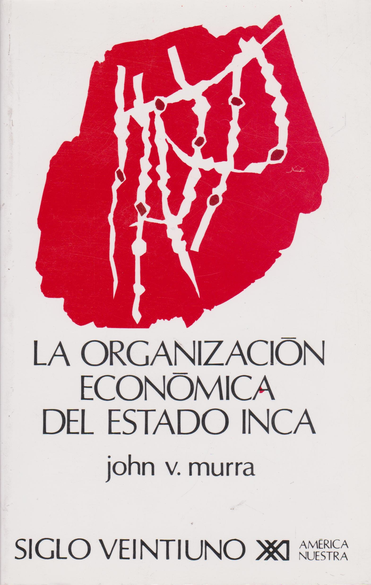

## QUAIS AMÉRICAS? {.center}

### Apresentação e reflexões sobre a disciplina {.center}

---

## Geografia do Continente {background-image="https://atlasescolar.ibge.gov.br/images/mapas/mundo/1920/continentes.jpg" background-opacity="0.2" .center}

- América do Norte
- América Central e Caribe
- América do Sul

---

## {background-image="https://atlasescolar.ibge.gov.br/images/mapas/mundo/1920/continentes.jpg" .center}

---

## Tamanho real {background-iframe="https://thetruesize.com/" background-interactive="true"}

::: {style="position: absolute; width: 40%; right: 0; background-color: rgba(255,255,255,0.9); color: black; padding: 20px; font-size: 20px;"}
A representação dos países e continentes no mapa **mundi** tradicional apresenta discrepâncias com a realidade. O site [The True Size](https://thetruesize.com/) nos ajuda a visualizá-las.
:::

---

## {background-iframe="https://thetruesize.com/" background-interactive="true" .center}

---

## Cronologia Clássica {.center}

- Período "Pré-Colombiano" (até o séc. XV)
- Período Colonial (XVI–XIX)
- Período das Américas Independentes (XIX–XXI)

---

## "Descobrimento da América"? {.center}

---

## Planisfério de Waldseemüller de 1507 {background-image="../imgs/planisferio1507.jpg" background-opacity="0.2" .center}

---

## {background-image="../imgs/planisferio1507.jpg" .center}

---

## Brasil e Américas {.center}

Integração latino-americana? Mercosul?

---

## Índio? Indígena? Nativos? {.center}

- Origem do termo
- Quem é o índio no séc. XIX?
- Identidade étnica e luta por direitos

---

## {.center}

Índio é um conceito étnico construído ao longo do séc. XX e atualmente é utilizado pelas próprias comunidades como estratégia de manter identidades e lutar por direitos, aliando-se a outras comunidades etnicamente distintas para mobilizar reivindicações aos Estados Nacionais.

---

## {.center}

> "Índio é todo descendente dos povos autóctones das Américas, conscientes de seus costumes, língua e tradições, mesmo que modificados ao longo do tempo, que seja considerado a partir dessa condição por si próprio e por pares."

SILVA, Kalina Vanderlei; SILVA, Maciel Henrique. "Índio". In: *Dicionário de conceitos históricos*. São Paulo: Contexto, 2009.

---

## O que vocês estudaram sobre as Américas no ensino básico? {.center}

---

## Colônia de Povoamento X Colônia de Exploração {.center}

### Um mito persistente {.center}

- Ibéricos X Britânicos
- Clima e Geografia
- Origens do "atraso" ou "sucesso" das colônias

---

## Afinal, o que é colonizar? {.center}

---

## Ilhas do Caribe e Mesoamérica {background-image="https://upload.wikimedia.org/wikipedia/commons/thumb/0/02/The_Florentine_Codex-_Aztec_Calendar.tiff/lossy-page1-1200px-The_Florentine_Codex-_Aztec_Calendar.tiff.jpg" background-opacity="0.2" .center}

---

## Regiões densamente habitadas {.center}

- Caribe
- Mesoamérica
- Região Andina

---

## {background-image="https://atlasescolar.ibge.gov.br/images/mapas/mundo/1920/america-central-e-caribe-politico.jpg"}

::: {style="position: absolute; width: 15%; right: 0; background-color: rgba(255,255,255,0.9); padding: 20px; font-size: 20px; text-align: center;"}
**Caribe**
:::

---

## Populações das ilhas do Caribe {.center}

Grande dificuldade para o estudo histórico: extermínio, destruição de fontes primárias, séculos de colonização com migrações frequentes.

Caminho de estudo principal: **arqueologia**.

---

##  {background-iframe="https://tainomuseum.org/home/#" background-interactive="true"}

::: {style="position: absolute; width: 40%; right: 0; background-color: rgba(255,255,255,0.9); color: #040404; padding: 20px; font-size: 20px;"}
Explore o site do Museu Taíno!

Etnia arawak que ocupava muitas ilhas caribenhas. Sua cultura ainda é uma marca importante em países como a República Dominicana.
:::

---

## Arawaks {.center}

- Ocupação das ilhas mais ao norte;
- Povos sedentários, população densa em algumas ilhas (como Hispañola);
- Agricultura (mandioca, milho e outros grãos);
- Organização política em unidades entre mil e dois mil habitantes;
- Organização social em *caciques*, mitaios (nobres), trabalhadores comuns e naborias (dependentes).

---

## Caraíbas {.center}

- Ocupavam as pequenas ilhas do sul;
- Semi-sedentários, oriundos da América do Sul;
- Haviam conquistado as ilhas menores do sul dos Arawaks e estavam em expansão no momento da chegada dos europeus;
- Desenvolveram grandes canoas oceânicas que permitiam longas viagens, enfrentar batalhas e realizar pesca extensiva.

---

## Sociedades da Mesoamérica (séc. V–XVI) {background-image="https://upload.wikimedia.org/wikipedia/commons/f/fb/Ancient_Mex.jpg" background-opacity="0.5"}

A partir do texto de NARDI, Tawnne T. de A. "Mesoamérica, Mexicas e Tlapanecas." (2019)

---

## [Miguel León-Portilla (1926–2019)](https://en.wikipedia.org/wiki/Miguel_Le%C3%B3n-Portilla) {.center}

*"La Visión de los Vencidos"*, 1959.

{width=250}

---

## Breve cronologia {.center}

- **9000 a.C.**: primeiros fósseis humanos;
- **5000 a.C.**: agricultura (abóbora, malagueta, feijão, milho);
- **2300 a.C.**: cerâmica;
- **1500 a.C.**: Sociedades complexas — urbanismo, comércio, artes, exércitos. Principal exemplo: **Olmecas**.

---

## Olmecas (séc. XIII a.C.) {.center}

{width=350}

---

## Olmecas (1500 a.C.–400 a.C.) {.center}

Desenvolvem-se na região sul do atual México. Cultura complexa — marcada por divisão do trabalho (comércio, agricultura, defesa, artes) e urbanismo com grandes praças e templos religiosos — tornou-se uma "alta cultura matriz" para toda a região mesoamericana. Difusão pelo comércio e pelo empenho religioso.

---

## Região Olmeca {.center}

{width=85%}

---

## Período Clássico (V–X) {.center}

Elementos que marcam as sociedades mesoamericanas: não conheciam a roda, sem metalurgia até 950 d.C., sem animais domésticos (além de perus e cães).

Duas sociedades do período clássico: **Teotihuacán** e **Maias**.

---

## Teotihuacán — Pirâmide do Sol {.center}

](https://upload.wikimedia.org/wikipedia/commons/thumb/5/59/Teotihuac%C3%A1n%2C_M%C3%A9xico%2C_2013-10-13%2C_DD_94.JPG/1280px-Teotihuac%C3%A1n%2C_M%C3%A9xico%2C_2013-10-13%2C_DD_94.JPG)

---

## Teotihuacán — Pirâmide da Lua {.center}

](https://upload.wikimedia.org/wikipedia/commons/thumb/5/58/Teotihuac%C3%A1n-5973.JPG/1280px-Teotihuac%C3%A1n-5973.JPG)

---

## Maias — Chichen Itza {.center}

](https://upload.wikimedia.org/wikipedia/commons/4/48/Chichen_Itza-18_%28cropped%29.jpg){width=80%}

---

## Maias — Templo de Kukulcán {.center}

](https://upload.wikimedia.org/wikipedia/commons/thumb/8/8d/El_Castillo_Stitch_2008_Edit_1.jpg/1280px-El_Castillo_Stitch_2008_Edit_1.jpg){width=80%}

---

## Período Pós-Clássico (950–1519) {background-image="https://upload.wikimedia.org/wikipedia/commons/d/df/Tonalpohualli_20.JPG" background-opacity="0.2" .center}

Formação, consolidação e expansão do Estado Mexica pela Mesoamérica.

--- 

##  {background-image="https://upload.wikimedia.org/wikipedia/commons/d/df/Tonalpohualli_20.JPG" .center}

::: {style="position: absolute; width: 15%; right: 0; background-color: rgba(255,255,255,0.9); padding: 20px; font-size: 20px; text-align: center;"}
[Pedra do Sol](https://pt.wikipedia.org/wiki/Pedra_do_Sol)
:::

---

## Códex Mendoza: mito fundador Mexica {.center}

](https://upload.wikimedia.org/wikipedia/commons/a/aa/CodexMendoza01.jpg)

---

## Cronologia Mexica {.center}

- **1325–1425**: Mexicas subjugados ao domínio Tecpaneca, devendo tributos e serviços;
- **1426–1430**: Guerra entre Mexicas e Tecpanecas. Vitória mexica garante independência e consolida o poder dos *pipiltin* ("nobres"), abrindo caminho para a expansão militar.
- **1430–1519**: Expansão militar com força bélica e "destino manifesto". Contínua expansão política e econômica sobre povos de diferentes etnias.

---

## A questão das Fontes Escritas {.center}

- Registros dos missionários
- Registros dos funcionários e militares europeus
- Escritos indígenas e de seus descendentes

---

## Historiografia sobre os Mexicas {.center}

- **Cronistas espanhóis e historiadores do séc. XIX**: interpretação eurocêntrica, aproximando as estruturas mexicas das da sociedade feudal europeia.
- **Morgan (1877) e Bandelier (1880)**: revisionismo que nega o caráter feudal. Afirma que não haveria "classes sociais diferenciadas" nem formas de organização política — apenas vínculos de sangue.

---

## Historiografia sobre os Mexicas {.center}

- **1930–1940**: Moreno, Kirchhoff, Monzón, Katz. Análise das fontes indígenas. Demonstram complexidade da organização social mexica: classes, posse da terra, formação de Estado.
- **1960–1970**: Interpretação marxista (Pedro Carrasco). Modo asiático de produção. Aldeias comunais, uso coletivo da terra.

---

## Historiografia sobre os Mexicas {.center}

- **1970–1980**: Análise sociocultural a partir das fontes indígenas, inclusive em língua náhuatl. León-Portilla e Christian Duverger.
- **1990**: Serge Gruzinski — o processo de ocidentalização criou uma imagem uniforme dos mundos nativos que em nada corresponde à diversidade desse universo.

---

## Expansão do Estado Mexica em 1519 {.center}

{width=80%}

---

## {.center}

{width=300}

---

## {.center}

---

## Sociedades Andinas antes de 1532 {background-image="https://upload.wikimedia.org/wikipedia/commons/thumb/3/32/CuscoPiedra12angulo.jpg/1280px-CuscoPiedra12angulo.jpg" background-opacity="0.5" .center}

A partir do texto de John Murra. "As sociedades andinas anteriores a 1532".

---

## [John Murra (1916–2006)](https://en.wikipedia.org/wiki/John_Victor_Murra) {.center}

Antropólogo que estudou a etnologia histórica dos Incas; grande autoridade nos estudos andinos.

---

## {.center}

*"[La organización económica del Estado Inca](https://dn720004.ca.archive.org/0/items/murra-john.-la-organizacion-economica-del-estado-inca-ocr-1999/Murra%2C%20John.%20-%20La%20organizacion%20economica%20del%20Estado%20Inca%20[ocr]%20[1999].pdf)"*, primeira edição de 1977 (tese defendida na Universidade de Chicago em 1955).

{width=200}

---

## Observações dos quinhentistas confirmadas pelas pesquisas históricas {.center}

- Paisagem única;
- Riqueza material, populacional, tecnológica (irrigação, edificações, metalurgia, estradas, produtos têxteis);
- Domínio político recente dos incas na região (três ou quatro gerações).

---

## A ocupação do território andino antes dos Incas {.center}

- **Pisos ecológicos**: grande variação de altitude em extensão reduzida;
- Desenvolvimento da agricultura: tubérculos, coca, cereais, milho;
- Controle vertical dos pisos ecológicos: colonização dispersa em "ilhas" — um **arquipélago**.

---

## {.center}

{width=400}

---

## Padrões de organização social pré-incaicos: **Ayllu** {.center}

> "A população andina vivia em uma multiplicidade de pequenas coletividades agropastoris (...) Cada aldeia era habitada por um conjunto de famílias unidas por laços de parentesco ou aliança, que representava um ayllu."

Henri Favre. *A civilização Inca*. Rio de Janeiro: Jorge Zahar Editor, 2004, p. 29-30.

---

## Padrões de organização social pré-incaicos: **Kuraka** {.center}

> "As células domésticas constitutivas do ayllu reconheciam um chefe ou Kuraka que era geralmente o fundador do grupo. O kuraka distribuía as terras, organizava os trabalhos coletivos e regulava os conflitos."

Henri Favre. *A civilização Inca*. Rio de Janeiro: Jorge Zahar Editor, 2004, p. 30-31.

---

## Padrões de organização social pré-incaicos: **Waka** {.center}

> "(...) Divindade tutelar do [ayllu] que era em geral um ancestral do kuraka e na qual este se apoiava para exercer sua autoridade."

Henri Favre. *A civilização Inca*. Rio de Janeiro: Jorge Zahar Editor, 2004, p. 30-31.

---

## Padrões de organização social pré-incaicos: **Terra** {.center}

Terra era coletiva, com lotes divididos por famílias no interior de cada Ayllu. O kuraka buscava garantir que cada família tivesse acesso a todos os pisos ecológicos — o acesso à terra como **complementariedade vertical** para subsistência.

---

## Padrões de organização social pré-incaicos: **Trabalho e tributo** {.center}

Sistema **redistributivo e de reciprocidade**: todos os membros do Ayllu deveriam trabalhar para o kuraka e a waka.

O serviço prestado em forma de trabalho era chamado de **mita**.

---

## {.center}

Cabia ao Kuraka redistribuir em produtos o trabalho que recebia, garantindo subsistência e reprodução da comunidade em momentos de crise, e sua posição de prestígio e poder.

Todos esses padrões (Ayllu, Kuraka, Waka, ocupação em arquipélago, Mita, redistribuição) **serão incorporados pelo Império Inca em sua expansão política e militar**.

---

## O Império Inca (c. 1400–1532) {background-image="https://upload.wikimedia.org/wikipedia/commons/thumb/2/23/Macchupicchu.jpg/1280px-Macchupicchu.jpg" background-opacity="0.5" .center}

---

## {background-image="https://upload.wikimedia.org/wikipedia/commons/thumb/2/23/Macchupicchu.jpg/1280px-Macchupicchu.jpg"}

---

## A expansão Inca (1438–1532) {.center}

{width=250}

---

## A formação do Tawantinsuyu {.center}

- Cusco foi fundada por Manco Capac (c. 1200) após décadas de migrações. A cidade-Estado consolidou seu poder no vale.
- Com Viracocha Inca, fundou-se o Tawantinsuyu em 1438 e iniciou-se a expansão militar com justificativa cultural: **"missão civilizadora"**.

---

## A expansão Inca {.center}

Os sucessos militares no vale de Cusco causaram desequilíbrio regional. As reações a essa hegemonia levaram a novas guerras e conquistas.

Em menos de 100 anos o império atingiu aproximadamente **950 mil km²**.

Quanto maior o império, mais as guerras externas eram necessárias para a estabilidade interna.

---

## O papel da guerra de conquista {.center}

> "A guerra de conquista constituía um fator essencial de integração e de mobilidade social dentro do Império. Ela representava o projeto coletivo que confederava os povos vencidos e subjugados. A realização de tal projeto era bastante lucrativa para tornar tangível aos olhos destes últimos as vantagens da dependência em que seriam mantidos."

Henri Favre. *A civilização Inca*. Rio de Janeiro: Jorge Zahar Editor, 2004, p. 26.

---

## O Domínio Inca e os impactos nas sociedades andinas {.center}

O Império Inca utiliza a mesma estrutura tradicional da região, mas impõe **novos sentidos** a ela.

O uso da **mita** é ampliado enormemente: implementada em diversas funções, os trabalhadores são enviados para regiões cada vez mais distantes. Isso enfraquece as chefias locais e o sistema de reciprocidade, garantindo renda e poder diretamente ao Estado Inca.

---

## Mexicas e Incas: Estados em expansão {background-image="https://upload.wikimedia.org/wikipedia/commons/thumb/e/e0/Codex_Borgia_page_17.jpg/1024px-Codex_Borgia_page_17.jpg" background-opacity="0.2" .center}

Ambos implementavam uma política expansionista, controlando e subjugando comunidades na Mesoamérica e na Região Andina. Esse domínio mesclava **diplomacia, ameaça de invasão militar e guerras**.

---

## {background-image="https://upload.wikimedia.org/wikipedia/commons/thumb/e/e0/Codex_Borgia_page_17.jpg/1024px-Codex_Borgia_page_17.jpg" background-opacity="0.2" .center}

Às vésperas da chegada dos espanhóis, mexicas e incas controlavam centenas de comunidades, cobrando **tributos** — em produtos (Mexicas) ou em trabalho (mita, entre os Incas) —, e mantendo **controle político e militar rígidos**. O que geraria insatisfação e traria consequências profundas para o futuro desses Estados.

---

## Bibliografia da aula {.center}

- NARDI, Tawnne T. de A. "Mesoamérica, Mexicas e Tlapanecas." In: **O império mexica e a província de Tlapa. Relações políticas e tributárias nos códices mesoamericanos (1461–1521)**. São Paulo: Universidade de São Paulo, 2019. pp. 25-54.

- MURRA, John. "As sociedades andinas anteriores a 1532". In: BETHEL, Leslie (org.). **História da América Latina: América Latina Colonial**. São Paulo: Edusp, 2004, pp. 63-100.
