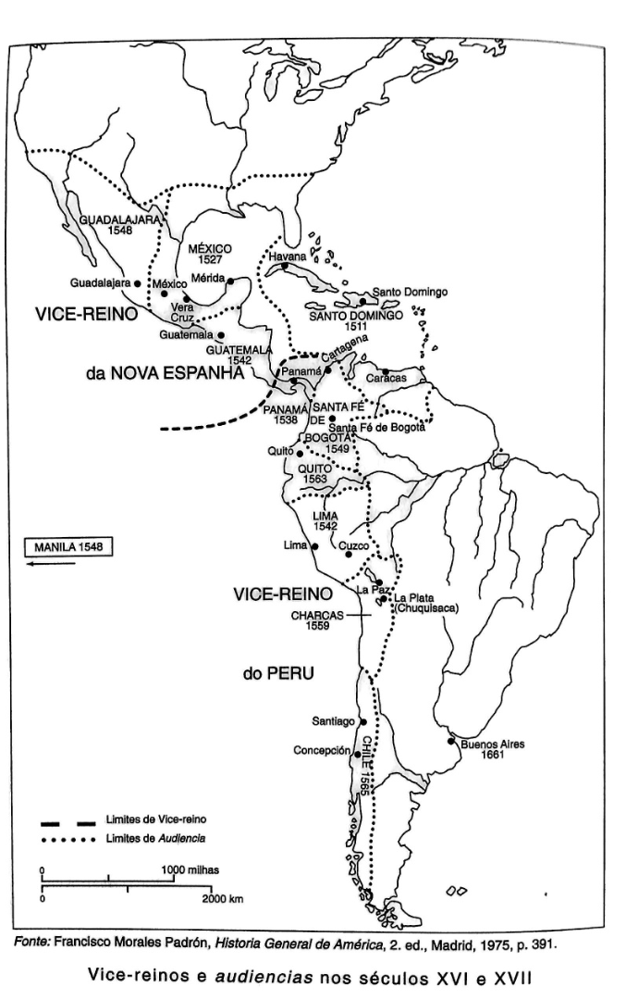
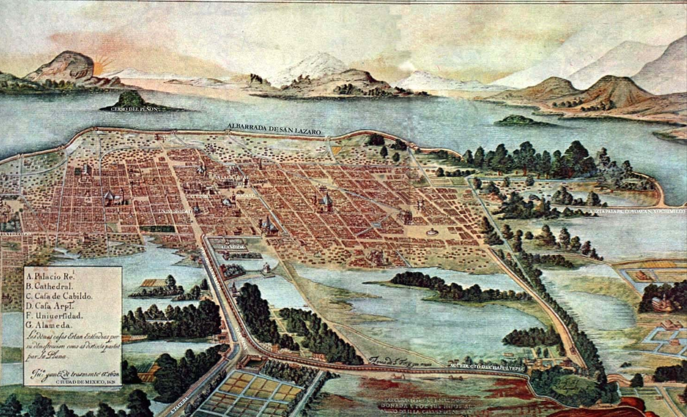
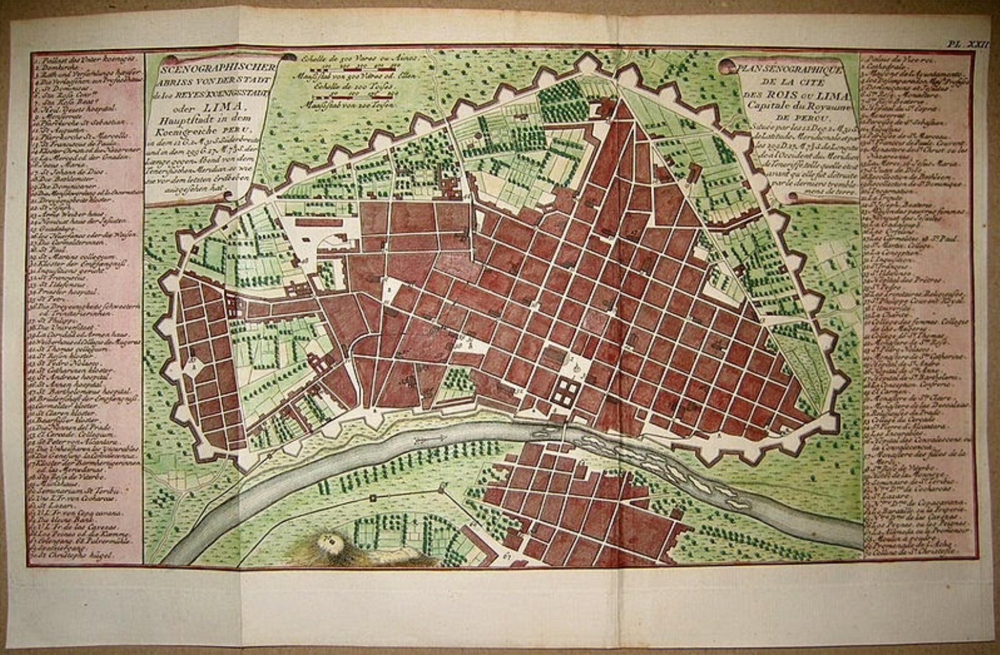

# Conteúdo da Aula 5

> **Arquivo editorial de revisão.** Faça aqui as alterações de conteúdo da aula. Enquanto o campo `status` estiver como `em revisão`, o `index.qmd` não deve ser atualizado. O `index.html` é uma prévia de leitura e não constitui a versão final aprovada.

> **Base desta versão:** ementa e calendário de 2026.2; conteúdo legado de `slides/aula-6/index.qmd`. O material foi reendereçado para a Aula 5 de 10 de setembro de 2026, sem acréscimos historiográficos.

## Slide 1 — Abertura

**Identificação:** CCLHM0076 · História da América: colonização e resistência

**Título:** Formação da sociedade colonial espanhola (XVI–XVIII)

**Docente:** Eric Brasil

**Data:** 10 de setembro de 2026

**Instituição:** UNILAB

---

## Slide 2 — Acesse os slides

**Título:** Acesse os slides da Aula 5

**Texto:** Abra a apresentação no celular e acompanhe no seu ritmo.

**Mídia:** QR code `../imgs/qrc_aula5.png`.

**Destino:** <https://ericbrasil.com.br/cclhm0076/slides/aula-5>

---

## Slide 3 — Objetivos da aula

- Compreender o processo de constituição da sociedade colonial espanhola nas Américas entre os séculos XVI e XVIII.

---

## Slide 4 — Percurso da aula

- Sistema administrativo e unidades de governo colonial.
- Centros urbanos, hierarquias sociais e sistema de castas.
- Economia colonial, formas de trabalho e poderes locais indígenas.

---

## Slide 5 — Sistema administrativo (XVI-XVII)

- Conquista: serviços e mercês reais — conquistadores como primeiros representantes da Coroa na colônia
- Necessidade de maior controle real: criação de uma estrutura administrativa burocratizada
- Casa de Contratação de Sevilha (1503): controle do tráfego de homens, navios e mercadorias
- Conselho das Índias (1524), sediado em Madri: tutela sobre as possessões americanas por meio de leis, decretos e instituições

---

## Slide 6 — Vice-Reinos

- 1535: Vice-Reino da Nova Espanha
- 1543: Vice-Reino do Peru
- 1717: Vice-Reino de Nova Granada
- 1776: Vice-Reino do Rio da Prata

---

## Slide 7 — O vice-rei

- Escolhido pelo monarca entre fidalgos de sangue nobre
- Acumulava os títulos de governador, capitão-geral e presidente da audiência
- "Corte de nobres" vivendo no palácio — mandato de aproximadamente 6 anos
- Representante máximo do rei em território americano

---

## Slide 8 — Francisco de Toledo, vice-rei do Peru (1569-1581)

- Redistribuição da população indígena, concentrando-a em unidades menores — com igrejas, prédios públicos, cadeias
- Estratégia para facilitar o controle, a cobrança de tributos e o recrutamento de mão de obra para as minas (Mita)

---

## Slide 9 — Sem título

---

## Slide 10 — Unidades administrativas menores

- **Governadorias**: funções burocráticas, administrativas e judiciais — 35 nos séculos XVI e XVII
- **Audiências**: tribunais judiciais supremos, vinculados ao Conselho das Índias — compostos por *oidores* (juízes vitalícios) e fiscais
- **Corregimientos**: grandes distritos com um centro urbano
- **Cabildos** (*ayuntamientos*): conselhos municipais destinados a regular a vida dos habitantes e fiscalizar as propriedades públicas

---

## Slide 11 — O poder dos Cabildos

- Centros de poder local, controlados pelas famílias mais abastadas, que se perpetuavam no poder
- Espaços fundamentais para a manutenção dos interesses da elite urbana nas colônias
- Tinham um *procurador* que podia enviar queixas e petições diretamente a Madri
- Alcance institucional: do nível local até o Conselho das Índias

---

## Slide 12 — Centros urbanos

- Modelo hispânico: ato político de reafirmar a ocupação e a subjugação das populações locais
- Reforçavam o poder das instituições coloniais e a segregação entre grupos sociais
- Índios e espanhóis separados em bairros distintos no interior das cidades
- Na prática, as interações, mestiçagens e hibridizações aconteciam constantemente nesses centros urbanos

---

## Slide 13 — Cidade do México colonial

---

## Slide 14 — Lima colonial

---

## Slide 15 — Maturidade das Índias Ocidentais espanholas

- Transformações sociais e étnicas: ampliação do setor espanhol, "mistura racial e cultural"
- Ampliação do mercado e produção de mercadorias europeias
- Crescimento e aperfeiçoamento da estrutura das cidades, das leis e das formas de controle
- Surgimento de uma nova categoria social/racial: o sistema de **Castas** — mestizos, mulatos e negros, além das categorias de espanhóis e índios

---

## Slide 16 — Economia colonial: a Hacienda

- Propriedades rurais: a *hacienda* como unidade produtiva central
  - Produtos europeus
  - Vários prédios, estâncias, propriedades individuais menores e terras indígenas
- Quanto mais forte o mercado local e mais denso o povoamento espanhol, mais unificada e poderosa era a *hacienda*

---

## Slide 17 — Mão de obra colonial

- **Encomienda**: concessão de trabalho indígena a colonos espanhóis em troca de proteção e evangelização
- **Repartimiento** (*Mita* no Peru): trabalho compulsório rotativo, forte especialmente nas minas — vigente até o século XVIII
- **Temporários informais**: trabalhadores recrutados fora dos mecanismos formais de controle

---

## Slide 18 — Obrajes e outras atividades

- **Obrajes**: oficinas de fabricação de tecidos para abastecer o mercado interno
  - Sem competição com produtos europeus
  - *Ropa de la Tierra*: para mestiços, espanhóis pobres e índios urbanos
  - Mão de obra: trabalhadores permanentes, sem capital para escravizados — coerção e dívidas
- Outras atividades: madeira, construção civil, couro
- Artesãos: grande presença nas cidades

---

## Slide 19 — Corregimiento de índios

- Ampliação do governo espanhol para o campo
- Distritos formados por várias unidades menores, com sede na cidade índia local
- Dependia dos mecanismos corporativos índios:
  - Coleta de impostos
  - Arregimentação de mão de obra
  - Manutenção da paz interna
  - Administração dos próprios negócios
- **Caciques**: intermediários fundamentais entre as comunidades indígenas e o governo colonial

---

## Slide 20 — Para a discussão

A leitura de **Ceballos (2009)** propõe uma questão central:

> A dicotomia metrópole/colônia dá conta da realidade política e social da América espanhola?

Vamos debater a partir do texto.

---

## Slide 21 — Bibliografia da aula

- CEBALLOS, Rodrigo. À margem do Império: autoridades, negociações e conflitos — modos de governar na América espanhola (séculos XVI e XVII). *SAECULUM — Revista de História* [21], João Pessoa, jul./dez. 2009, pp. 161-171.

---

## Slide 22 — Bibliografia da aula

- CEBALLOS, Rodrigo. À margem do Império: autoridades, negociações e conflitos — modos de governar na América espanhola (séculos XVI e XVII). *SAECULUM — Revista de História*, [21], João Pessoa, jul./dez. 2009, pp. 161–171.
- RAMINELLI, Ronald. "A monarquia católica e os poderes locais do Novo Mundo." *Simpósio Nacional de História*, XXVI, São Paulo, 2011, pp. 1–26.
- STOLKE, V. O enigma das interseções: classe, "raça", sexo, sexualidade: a formação dos impérios transatlânticos do século XVI ao XIX. *Revista Estudos Feministas*, v. 14, n. 1, p. 15–42, jan. 2006.

---

## Slide 23 — Próxima aula

**Aula 6 — 24/09/2026**

**Tema:** Resistências, negociações e agência indígenas nos séculos XVI e XVII.

**Módulo II** — Conquistas, Colonização e Resistências.

---

# Ponto de corte editorial

**Último slide incluído:** Slide 23 — Próxima aula.

**Primeiro slide reservado à aula seguinte:** o tema da Aula 6, sobre resistências, negociações e agência indígenas.

**Nota de preservação:** o QMD legado em `slides/aula-6/index.qmd` não foi alterado. A sincronização com o `index.qmd` da Aula 5 depende da aprovação desta revisão.
