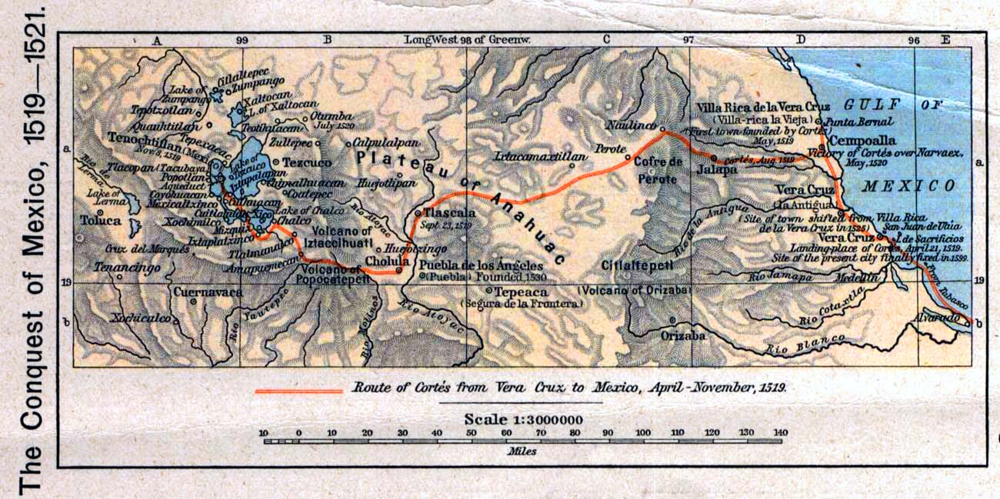
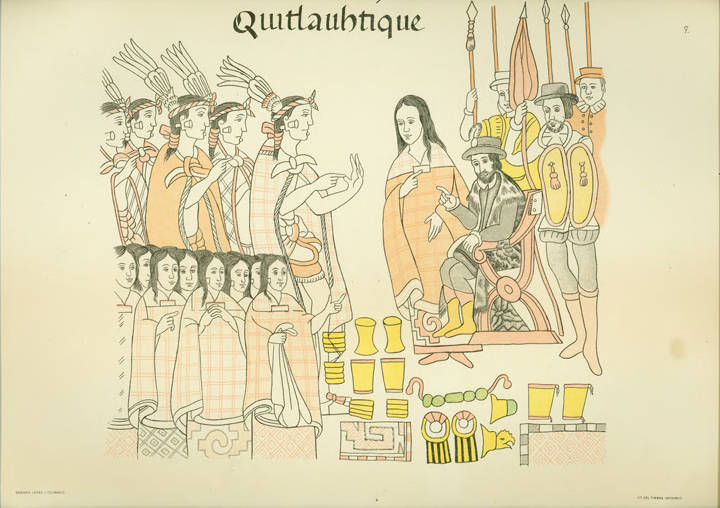
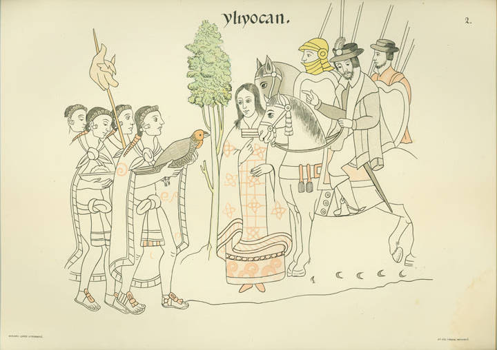
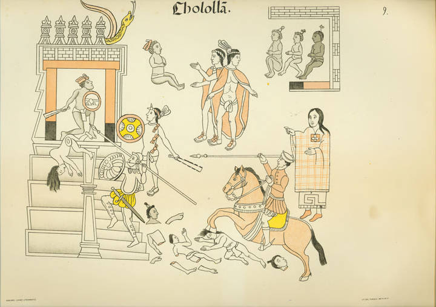
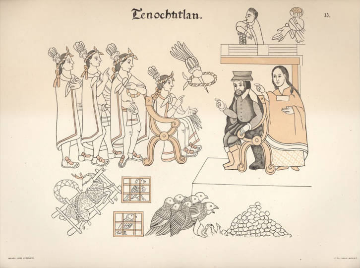
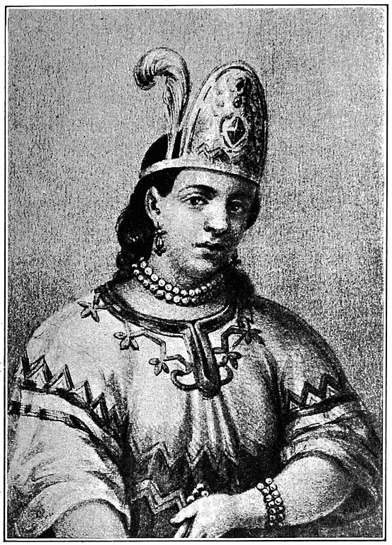
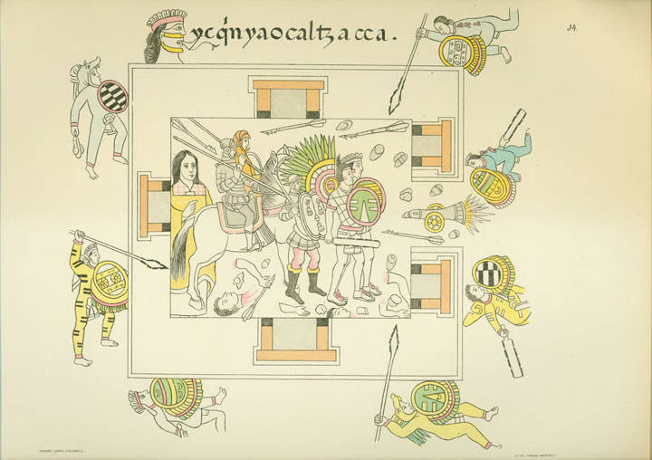
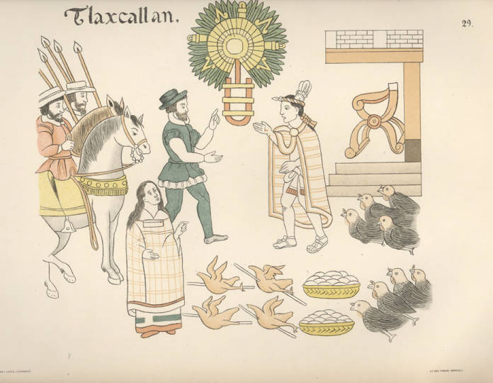
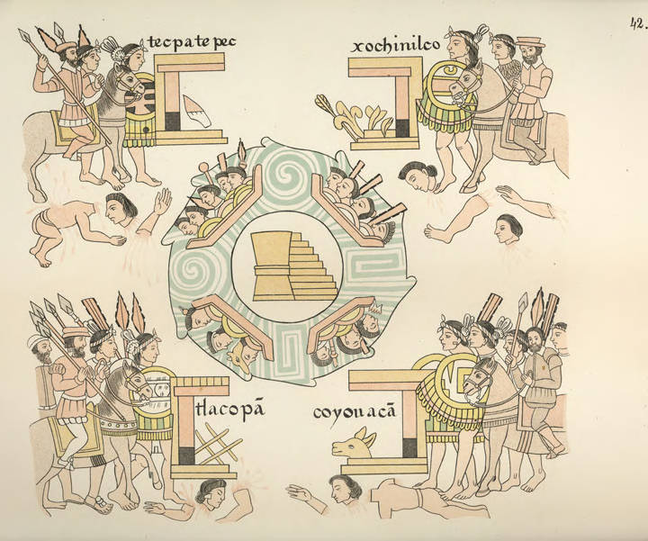
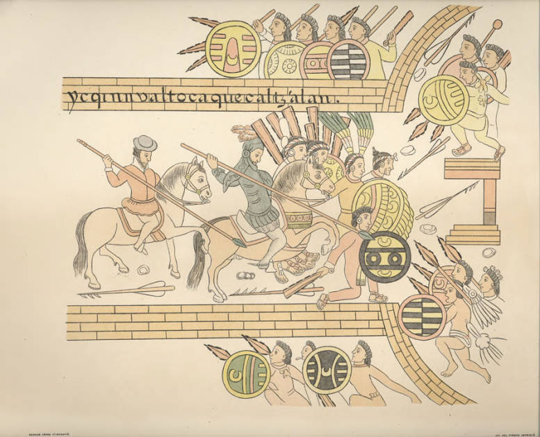

## Conquista das ilhas do Caribe (1492–1519) {.center}

- Ouro de aluvião
- Escravização
- Extermínio
- Início de colonização:
  - Cuba — sede de governo
  - Base para expansão para o continente

---

## A expedição de Hernán Cortés (1519–1521) {.center}

---

## Primeira fase {.center}

- Aliança e contatos iniciais com povos locais (1519)
- Aliança com os tlaxcaltecas

---

## Segunda fase {.center}

- Castelhanos convidados em México-Tenochtitlan (1519–1520): chegam na cidade com dez mil indígenas e 500 castelhanos;
- Sequestro dos chefes;
- Massacre do Templo Mayor;
- Noche Triste.

---

## Terceira fase {.center}

- Recomposição de forças (1520–1521): composição de novas alianças e epidemias de varíola.

---

## Quarta fase {.center}

- Sítio de México-Tenochtitlan (maio a agosto de 1521);
- Coalização de 20 mil indígenas e mil castelhanos;
- Derrota dos mexicas.

---

## {.center}

::: {style="font-size: 0.6em; text-align: center;"}
University of Texas at Austin. *Historical Atlas* by William Shepherd (1923–26)
:::

---

## Historiografia sobre a conquista {.center}

- **Século XIX**: visão eurocêntrica, civilizatória; heroísmo e superioridade técnica e militar dos castelhanos;
- **Pierre Chaunu**: visão de "guerra de conquista"; factual;
- **Rugiero Romano**: Armas + Igreja + desestruturação social.

---

## Historiografia sobre a conquista {.center}

- **História dos vencidos**: Miguel León-Portilla e Nathan Wachtel;
- **Hibridismo cultural**: Serge Gruzinski;
- **Eduardo Natalino dos Santos**: alianças e guerras, tensões e negociações.

---

## História dos Vencidos {.center}

- Busca trazer as interpretações indígenas da conquista espanhola;
- Crítica ao eurocentrismo;
- Incorporação das perspectivas indígenas, solenemente ignoradas até então;
- Ouvir as vozes dos povos indígenas da América Latina;
- Visibilidade à resistência indígena.

---

## Crítica de Eduardo Natalino dos Santos {.center}

- Apresenta a conquista militar como uma "obra realizada exclusivamente pelos castelhanos";
- Atenção apenas nos indígenas derrotados, como se esses representassem a totalidade dos povos.

---

## Hibridismo Cultural {.center}

- Vertente de história cultural influenciada pela história dos vencidos;
- Buscava explicar as transformações socioculturais das populações ameríndias após o contato;
- "Os conceitos (mestiçagem e hibridismo) dariam conta de explicar a constituição das novas sociedades coloniais e a atuação de grande parte de seus agentes históricos."

---

## Crítica de Eduardo Natalino dos Santos {.center}

- Apresenta os povos indígenas como "não totalmente derrotados no âmbito cultural ou social", mas mantém os mesmos problemas da história dos vencidos;
- Entende a conquista da cidade do México como a conquista de todo o território da Nova Espanha;
- Identifica os diversos povos indígenas com os mexicas: simplificação;
- Opõe dois tipos de agentes ou forças políticas: índios X espanhóis.

---

## {.center}

> "Por meio da análise de fontes nahuas […], mostramos que as guerras e alianças realizadas entre castelhanos e altepeme [plural de altepetl, unidades político-territoriais] mesoamericanos para consumar a queda de México-Tenochtitlan, entre 1519 e 1521, lançaram as bases políticas e militares que permitiam a conquista, ao longo do século XVI, de grande parte dos territórios que viriam a ser a Nova Espanha, a qual não se deu de forma automática a partir da queda da capital mexica."

(SANTOS, 2014, p. 221)

---

## [Lienzo de Tlaxcala (1552)](https://archive.org/details/lienzo-of-tlaxcala) {.center}

](../imgs/Lienzo_de_tlaxcala_full_SD.jpg)

---

## {.center}

---

## {.center}

---

## {.center}

---

## {.center}

---

## {.center}

{width=40%}

---

## {.center}

TOWNSEND, Camilla. *Malintzin's choices: an Indian woman in the conquest of Mexico*. Albuquerque: University of New Mexico Press, 2006.

---

## La Malinche: Quem foi? {.center}

- Também conhecida como Malintzin ou Doña Marina;
- Mulher indígena nahua entregue aos espanhóis em 1519;
- Se tornou intérprete, conselheira e companheira de Hernán Cortés;
- Figura controversa: traidora ou sobrevivente?

---

## Breve história {.center}

- Nascida por volta de 1500 na região de Coatzacoalcos;
- Vendida como escravizada ainda jovem e levada para os maias;
- Em 1519, entregue aos espanhóis pelos senhores de Tabasco;
- Aprendeu espanhol rapidamente e tornou-se a principal intérprete de Cortés.

---

## Casamento e descendência {.center}

- Teve um filho com Cortés: **Martín Cortés**, um dos primeiros mestiços de destaque na Nova Espanha;
- Após a conquista, foi dada em casamento a **Juan Jaramillo**, um dos capitães espanhóis;
- Com Jaramillo, teve uma filha chamada **María Jaramillo**;
- O casamento pode ter sido uma estratégia para garantir status social na nova ordem colonial.

---

## Importância como intérprete {.center}

- Facilitou a comunicação entre os espanhóis e diferentes povos indígenas;
- Usou sua fluência em maia e náuatle para traduzir entre os povos e Cortés;
- Papel essencial nas negociações políticas e alianças entre os espanhóis e grupos indígenas rivais dos mexicas;
- Sua habilidade como tradutora ajudou na queda de Tenochtitlán em 1521.

---

## {.center}

---

## {.center}

---

## {.center}

---

## {.center}

---

## Bibliografia da aula {.center}

- SANTOS, Eduardo Natalino dos. "As conquistas de México-Tenochtitlan e da Nova Espanha". *História Unisinos*, v. 18, n. 2, 2014.

- TOWNSEND, Camilla. *Malintzin's choices: an Indian woman in the conquest of Mexico*. Albuquerque: University of New Mexico Press, 2006.

- Relatos Astecas da Conquista. Trechos selecionados.
