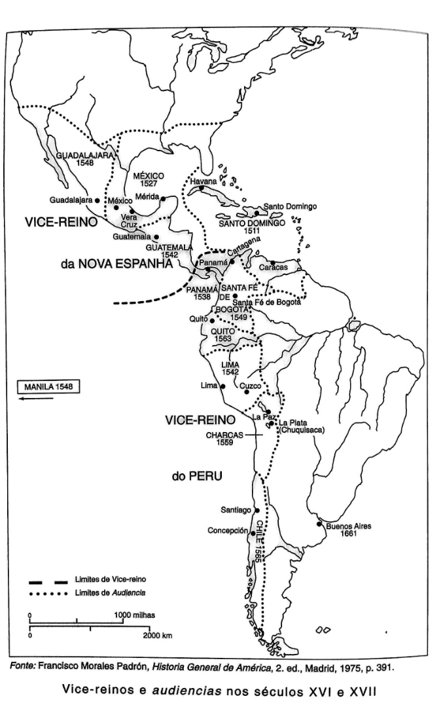
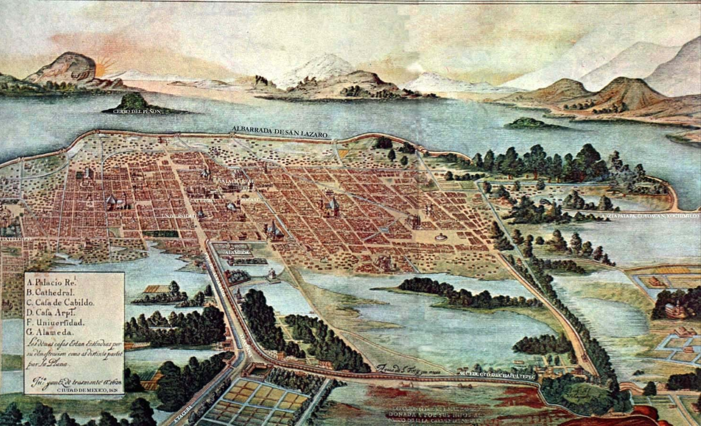
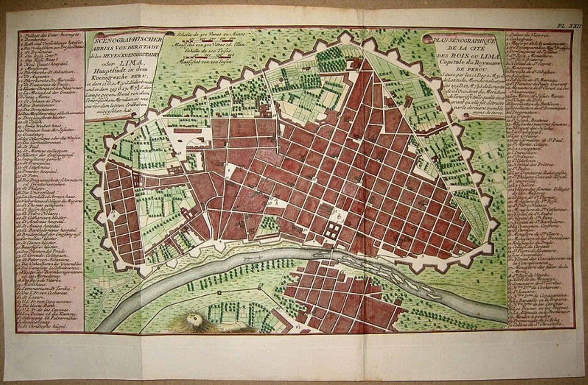

## {.center}

---

## Formação da sociedade colonial espanhola {.center}

- Como se organizou o governo colonial nas Américas?
- Que instituições, agentes e práticas sustentaram o Império espanhol entre os séculos XVI e XVIII?

---

## Sistema administrativo (XVI-XVII) {.center}

- Conquista: serviços e mercês reais — conquistadores como primeiros representantes da Coroa na colônia
- Necessidade de maior controle real: criação de uma estrutura administrativa burocratizada
- Casa de Contratação de Sevilha (1503): controle do tráfego de homens, navios e mercadorias
- Conselho das Índias (1524), sediado em Madri: tutela sobre as possessões americanas por meio de leis, decretos e instituições

---

## Vice-Reinos {.center}

- 1535: Vice-Reino da Nova Espanha
- 1543: Vice-Reino do Peru
- 1717: Vice-Reino de Nova Granada
- 1776: Vice-Reino do Rio da Prata

---

## O vice-rei {.center}

- Escolhido pelo monarca entre fidalgos de sangue nobre
- Acumulava os títulos de governador, capitão-geral e presidente da audiência
- "Corte de nobres" vivendo no palácio — mandato de aproximadamente 6 anos
- Representante máximo do rei em território americano

---

## Francisco de Toledo, vice-rei do Peru (1569-1581) {.center}

- Redistribuição da população indígena, concentrando-a em unidades menores — com igrejas, prédios públicos, cadeias
- Estratégia para facilitar o controle, a cobrança de tributos e o recrutamento de mão de obra para as minas (Mita)

---

## {.center}

---

## Unidades administrativas menores {.center}

- **Governadorias**: funções burocráticas, administrativas e judiciais — 35 nos séculos XVI e XVII
- **Audiências**: tribunais judiciais supremos, vinculados ao Conselho das Índias — compostos por *oidores* (juízes vitalícios) e fiscais
- **Corregimientos**: grandes distritos com um centro urbano
- **Cabildos** (*ayuntamientos*): conselhos municipais destinados a regular a vida dos habitantes e fiscalizar as propriedades públicas

---

## O poder dos Cabildos {.center}

- Centros de poder local, controlados pelas famílias mais abastadas, que se perpetuavam no poder
- Espaços fundamentais para a manutenção dos interesses da elite urbana nas colônias
- Tinham um *procurador* que podia enviar queixas e petições diretamente a Madri
- Alcance institucional: do nível local até o Conselho das Índias

---

## Centros urbanos {.center}

- Modelo hispânico: ato político de reafirmar a ocupação e a subjugação das populações locais
- Reforçavam o poder das instituições coloniais e a segregação entre grupos sociais
- Índios e espanhóis separados em bairros distintos no interior das cidades
- Na prática, as interações, mestiçagens e hibridizações aconteciam constantemente nesses centros urbanos

---

## Cidade do México colonial {.center}

---

## Lima colonial {.center}

---

## Maturidade das Índias Ocidentais espanholas {.center}

- Transformações sociais e étnicas: ampliação do setor espanhol, "mistura racial e cultural"
- Ampliação do mercado e produção de mercadorias europeias
- Crescimento e aperfeiçoamento da estrutura das cidades, das leis e das formas de controle
- Surgimento de uma nova categoria social/racial: o sistema de **Castas** — mestizos, mulatos e negros, além das categorias de espanhóis e índios

---

## Economia colonial: a Hacienda {.center}

- Propriedades rurais: a *hacienda* como unidade produtiva central
  - Produtos europeus
  - Vários prédios, estâncias, propriedades individuais menores e terras indígenas
- Quanto mais forte o mercado local e mais denso o povoamento espanhol, mais unificada e poderosa era a *hacienda*

---

## Mão de obra colonial {.center}

- **Encomienda**: concessão de trabalho indígena a colonos espanhóis em troca de proteção e evangelização
- **Repartimiento** (*Mita* no Peru): trabalho compulsório rotativo, forte especialmente nas minas — vigente até o século XVIII
- **Temporários informais**: trabalhadores recrutados fora dos mecanismos formais de controle

---

## Obrajes e outras atividades {.center}

- **Obrajes**: oficinas de fabricação de tecidos para abastecer o mercado interno
  - Sem competição com produtos europeus
  - *Ropa de la Tierra*: para mestiços, espanhóis pobres e índios urbanos
  - Mão de obra: trabalhadores permanentes, sem capital para escravizados — coerção e dívidas
- Outras atividades: madeira, construção civil, couro
- Artesãos: grande presença nas cidades

---

## Corregimiento de índios {.center}

- Ampliação do governo espanhol para o campo
- Distritos formados por várias unidades menores, com sede na cidade índia local
- Dependia dos mecanismos corporativos índios:
  - Coleta de impostos
  - Arregimentação de mão de obra
  - Manutenção da paz interna
  - Administração dos próprios negócios
- **Caciques**: intermediários fundamentais entre as comunidades indígenas e o governo colonial

---

## Para a discussão {.center}

A leitura de **Ceballos (2009)** propõe uma questão central:

> A dicotomia metrópole/colônia dá conta da realidade política e social da América espanhola?

Vamos debater a partir do texto.

---

## Bibliografia da aula {.center}

- CEBALLOS, Rodrigo. À margem do Império: autoridades, negociações e conflitos — modos de governar na América espanhola (séculos XVI e XVII). *SAECULUM — Revista de História* [21], João Pessoa, jul./dez. 2009, pp. 161-171.
